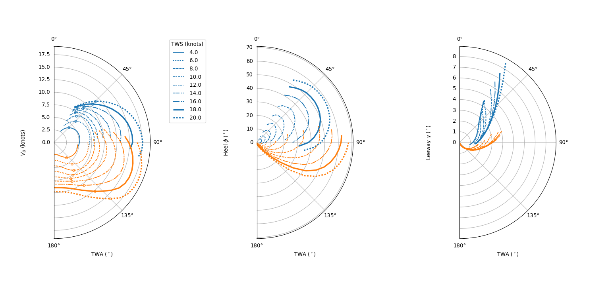

# Python-VPP


3-DOF Velocity Prediction Program base on the [ORC](https://www.orc.org/index.asp?id=21) aero and hydro dynamic models. The code make use of Object-oriented-Programming to be as general as possible.


## Getting Started
### To Do List (prioritized)
1. ~~wrap rig into yacht class~~, and update measure functions
2. validate on YD-41 (Principle of Yacht Design), and write tests
3. ~~optimize the boat velocity with the 3-DOF equlibrium as constraints (Lagrange multipliers)~~
4. Add all the windag contributions (mast, crew, rigging, etc.)
5. Optional Delft hydro model
6. Add dagerboards to the possible appendages  
6. ~~tidy plotting and results~~

### Prerequisites

There are only a few prerequisites to run this code, most python instalation will have them. We advise to use the `environment.yml` file provided in this repo to set-up a new conda environment to use the code (this keeps you machine nice and tidy).

To create the environment simply run from the cloned/downloaded repo

```bash
$ conda env create -f environment.yml
```
and then active the new environment

```bash
$ conda activate Python-VPP
```

> **_NOTE:_** If you want to change the conda environment name, edit the first line of the `environment.yml` file.

### Running the tests

You can run a benchmark agains the YD-41 results from WinVPP by running the `benchmark.py` script.

```python
$ python benchmark/benchmark.py -g -o
```

with the `graph` and `output` optional keyboard arguments.

## Using the code

To use the code, forst clone or download this repository onto your own machine. The main file that are used are `OOpyVPP.py` and `righting_moment.json`. These have to be filled with the data of your boat. By default they are using the YD-41 (from Principle of Yacht Design). To run the code simply type

```python
$ python runVPP.py
```

into your console, and the code should run. Once the code has run, it should generate the following figure (or a similar one)

<p align="center">
    
</p>

See the [documentation](https://marinlauber.github.io/Python-VPP/).

### Input variable

This is a crude list of all the input variables and their meaning, as well as the units they are expected to be in.

1. Appendages :
    * Cu : Root Chord / Upper Chord (m)
    * Cl : Tip Chord / Lower Chord (m)
    * Span : Span (m) 
1. Yacht : 
    * Lwl : Length waterline (m)
    * Vol : Displ. volume of canoebody (m^3)
    * Bwl : Beam waterine (m)
    * Tc : Canoebody draft (m)
    * WSA : Wetted surface area (m^2)
    * Tmax : Draft max, i.e. Keel (m)
    * Amax : Max. section area (m^2)
    * Mass : Total mass of the yacht, includeing keel (kg)
    * Ff : Freeboard heigt fore (m)
    * Fa : Freeboard height aft (m)
    * Boa : Beam overall (m)
    * Loa : Length overall (m)
    * App : List of appendages
    * Sails : List of Sails
1. Sails:
    Standard measurements, except Roach is defined as 1-A/(0.5PE)
    Kite only takes area and vce esitmate (this is very rough)
1. VPP.set_analysis()
    * TWA range : range of TWA to use
    * TWS range : range of TWS, must be between [2, 35]


## Authors

* **[Otto Villani](https://www.linkedin.com/in/otto-villani-552760108/)** - *Initial idea, model selection* - [github](https://github.com/ottovillani)
* **[Marin Lauber](https://www.linkedin.com/in/marin-lauber/)** - *Initial idea, developement* - [github](https://github.com/marinlauber)
* **[Thomas Dickson](tajd.github.io)** - *Developer*

## License

This project is licensed under the MIT License - see the [LICENSE](LICENSE) file for details

## Acknowledgments

* Hat tip to anyone whose code was used
* Inspiration

## Modifications

1. Formatted using [Black](https://github.com/psf/black).
1. Added a "name" to the Yacht class which can be passed to plotting function.
1. Renamed instances of Keel and Rudder objects in the example function.